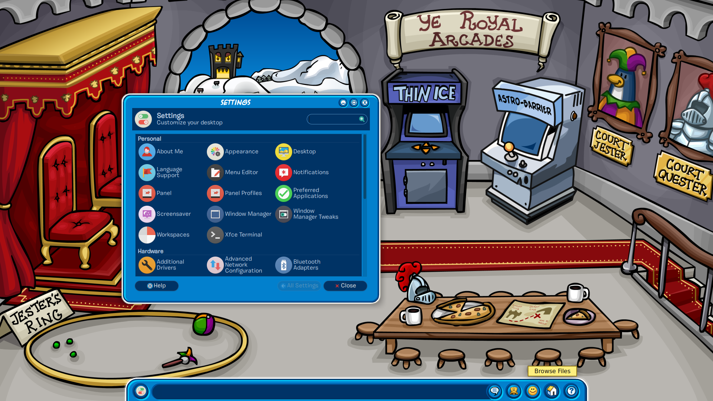
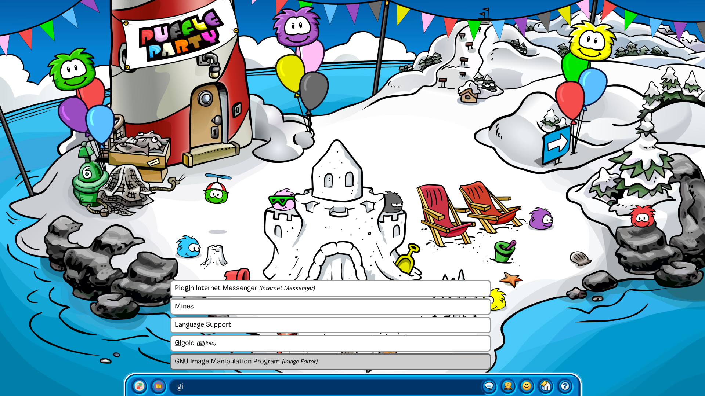

# WaddleOS*
\*not a real os.

This project aims to bring the glory of the legendary children's flash game, Club Penguin, to your desktop interface. It is essentially a collection of themes and a bit of custom software that is designed to work in the XFCE desktop environment. 

This has been tested to work with Xubuntu 22.04, but it should work on any Linux distribution that uses a modern version of XFCE. Different distributions may require files to be placed in different places.

Features:
- Dock and search bar intended to mimic Club Penguin's blue interface bar
- A custom GTK theme, and fonts to go with it, that mimic how pop-up windows in Club Penguin looked
- Hand-picked backgrounds showing old party scenes. These automatically change on a monthly basis to reflect a party that occured in that same month (eg December's background is from the Christmas party).





## Setup

### Install needed programs
Ensure you are running xfce with xfwm4 and a compositor (works best with xfwm4's built-in one).

dconf-cli:
`sudo apt install dconf-cli`

dockbarx:
```
sudo add-apt-repository ppa:xuzhen666/dockbarx
sudo apt install -y dockbarx
sudo apt install -y xfce4-dockbarx-plugin
```

rofi 1.7.3 can be installed by a ppa (easier) or compiling from source (safer):
```
sudo add-apt-repository ppa:cppiber/ppa
sudo apt install -y rofi
```

OR
```
sudo apt install -y autoconf automake pkg-config flex bison check 
sudo apt install -y libpango1.0-dev libcairo2-dev libglib2.0-dev libstartup-notification0-dev libxkbcommon-dev libxkbcommon-x11-dev libxcb-xkb-dev libxcb-randr0-dev libxcb-xinerama0-dev libxcb1-dev libxcb-util-dev libxcb-ewmh-dev libxcb-icccm4-dev libxcb-imdkit-dev libxcb-cursor-dev libgdk-pixbuf2.0-dev
sudo apt install -y libc6 libcairo2 libglib2.0-0 libpango-1.0-0 libpangocairo-1.0-0 librsvg2-2 libstartup-notification0 libxcb-ewmh2 libxcb-icccm4 libxcb-randr0  libxcb-util1 libxcb-xinerama0 libxcb-xkb1 libxcb-xrm0 libxcb1 libxkbcommon-x11-0 libxkbcommon0

wget https://github.com/davatorium/rofi/releases/download/1.7.3/rofi-1.7.3.tar.gz
tar -xzf rofi-1.7.3.tar.gz
cd rofi-1.7.3/
mkdir build && cd build
../configure --disable-check
make
sudo make install
```

Numix Circle icon theme (optional but looks good with theme):
`sudo apt install -y numix-icon-theme-circle`


### Setup files
**NOTE: pre-existing Dockx settings and rofi config WILL BE DELETED**. Please back them up before doing this.

Run this inside the WaddleOS folder.
```
mkdir ~/.config/rofi
cp config.rasi ~/.config/rofi/
mkdir -p ~/.local/share/dockbarx/themes/popup_styles
cp ClubPenguin-dockx.tar.gz ~/.local/share/dockbarx/themes/
cp ClubPenguin-popup-dockx.tar.gz ~/.local/share/dockbarx/themes/popup_styles
cp -r waddleos/ ~/.local/share/
mkdir ~/.themes
cp -r ClubPenguin-gtk/ ~/.themes/
mkdir ~/.local/share/themes/
cp -r ClubPenguin-xfwm/ ~/.local/share/themes/
cp -r fonts ~/.local/share
cp -r club-penguin-toolbar-plugin ~/Documents
dconf load /org/dockbarx/ < dockx-settings.ini
```


### Compile custom xfce panel plugin
For this, install:
- make
- xfce4-dev-tools
- git
- glib2 (in Ubuntu 20.04 is called libglib2.0-dev)
- xorg-x11-devel (libx11-dev)
- libxfce4ui-2-0
- libxfce4ui-2-dev
- libxfce4panel-2.0-dev

On Ubuntu 22.04:
`sudo apt install make xfce4-dev-tools git libglib2.0-dev libx11-dev libxfce4ui-2-0 libxfce4ui-2-dev libxfce4panel-2.0-dev `

Now compile and install it:
```
cd ~/Documents/club-penguin-toolbar-plugin
./autogen.sh
make
sudo make install

sudo ln -s /usr/local/share/xfce4/panel/plugins/sample.desktop /usr/share/xfce4/panel/plugins/sample.desktop
sudo mkdir -p /usr/lib/xfce4/panel-plugins
sudo ln -s /usr/local/lib/xfce4/panel/plugins/libsample.la /usr/lib/xfce4/panel-plugins
sudo ln -s /usr/local/lib/xfce4/panel/plugins/libsample.so /usr/lib/xfce4/panel-plugins
```

### Activate WaddleOS
Toolbar panel:
- Go to Panel Preferences > Backup and restore > Import 
- Select ClubPenguin-xfce-panel-config.tar.bz2 and save configuration
- Apply this configuration

Set gtk theme:
- Launch Appearance
- Select oomox-ClubPenguin as gtk style
- In the fonts section, change default font to A.C.M.E. Explosive or Burbank
- If you want to use the Numix theme, go to Icons and select Numix Circle

Window theme:
- Launch Window Manager, and set xfwm theme to ClubPenguin-xfwm
- Set title font to A.C.M.E. Explosive

To enable the auto-background cronjob, run this in a terminal:
```
line="*/30 * * * * sudo -u $USER -HEs /home/$USER/.local/share/waddleos/set-background.sh >> /home/$USER/.local/share/waddleos/cronlogs"
(crontab -u $(whoami) -l; echo "$line" ) | crontab -u $(whoami) -
sudo service cron restart
```

Every 30 minutes this will check if the background name matches the current month, and change it if it doesn't. If the image name isn't a number from 1 to 12, it won't do anything.

To update the background right now:
```
cd ~/.local/share/waddleos/
./force-background.sh
```

## Credits
Custom toolbar widget based off XFCE sample plugin: https://github.com/xfce-mirror/xfce4-sample-plugin

GTK theme created with Oomox

Background images sourced from https://clubpenguin.fandom.com/wiki/Club_Penguin_Wiki


